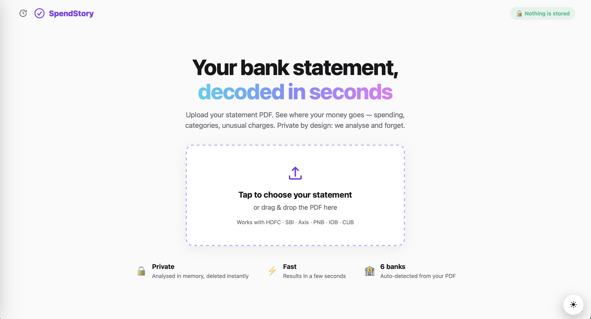
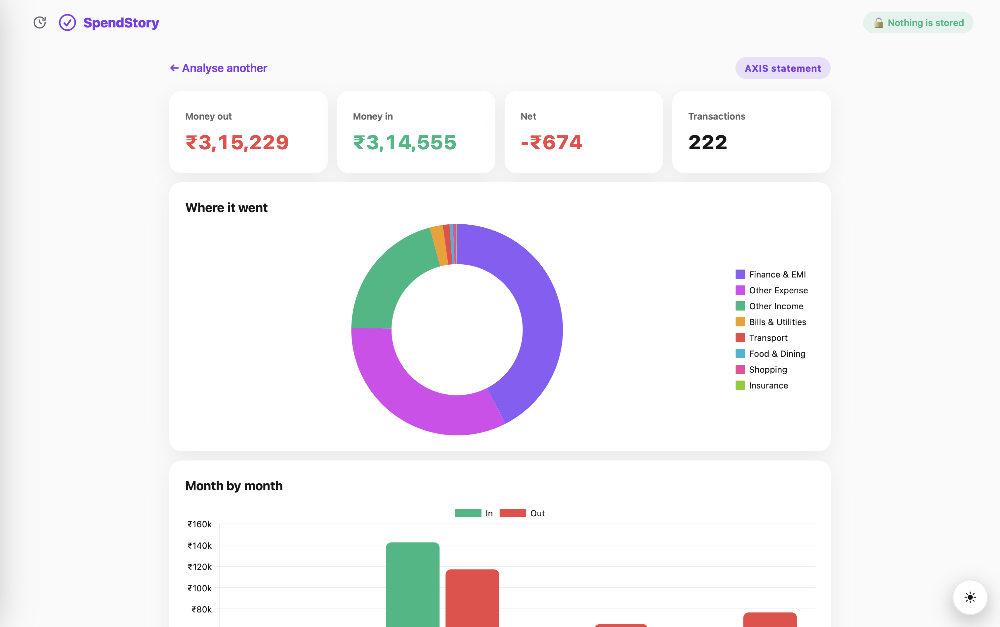
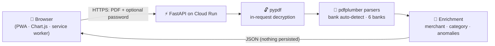

# 💜 SpendStory

**Your bank statement, decoded in seconds.**

[](https://github.com/ARAVINDHRAJA123/spendstory/actions)
[](https://spendstory-616665622891.asia-south1.run.app)
[](#-install-it-like-an-app)
[](#-privacy-by-design)

Upload a bank statement PDF → get an instant, beautiful dashboard of where your money went.
Built for everyone — including people who have never heard of "localhost" or "CSV".

**🔗 Try it now: https://spendstory-616665622891.asia-south1.run.app**

---

## ✨ What it does

| | Feature |
|---|---|
| 🏦 | **6 banks, auto-detected** — HDFC, SBI (both statement formats), Axis, PNB, IOB, CUB |
| 🔐 | **Password-locked PDFs** — enter the bank's PDF password, decrypted in-memory only |
| 📊 | **Instant dashboard** — money in/out, category donut, month-by-month bars, top merchants |
| ⚠️ | **Unusual-spend alerts** — statistically large payments (mean + 2σ) flagged for review |
| 🔍 | **Searchable transactions** — every row, categorised and merchant-cleaned |
| 🕐 | **Past analyses** — last 5 dashboards saved *on your device only*, reopenable offline |
| 🌗 | **Dark / light mode** — circular-wipe transition via the View Transitions API |
| 📱 | **Works everywhere** — iPhone, Android, Windows, Mac — one codebase, installable |

## 📸 Screenshots

| Upload | Dashboard |
|---|---|
|  |  |

## 🔒 Privacy by design

The headline feature is what it **doesn't** do:

- Your PDF is parsed **in memory** and deleted in a `finally` block — it never outlives the HTTP request
- **No accounts. No database. No server-side storage.** We can't leak what we never keep
- "Past analyses" live in *your browser's* localStorage — one tap clears them
- Strict security headers: CSP (`'self'` only — zero third-party scripts), `nosniff`, frame-deny, no-referrer
- The service worker explicitly never caches `/api` responses

## 🏗 Architecture



The parsing engine is shared with my [Bank-Statement-Analyser](https://github.com/ARAVINDHRAJA123/Bank-Statement-Analyser)
pipeline project (PDF → BigQuery → dbt → Airflow). SpendStory is its consumer-facing face:
same battle-tested parsers, zero setup for the user.

**Parser correctness is provable, not vibes:** every statement's running balance is reconciled
row-by-row (`prev − debit + credit = current`) — the Axis and SBI parsers ship with **0 mismatches**
across 222- and 613-transaction real statements, and totals match the statements' own printed
`TRANSACTION TOTAL` lines to the paisa.

## 🚀 Run locally

```bash
git clone https://github.com/ARAVINDHRAJA123/spendstory.git
cd spendstory
python3 -m venv venv && ./venv/bin/pip install -r requirements.txt
./venv/bin/uvicorn main:app --app-dir backend --port 8321
# open http://localhost:8321
```

## ☁️ Deploy your own (one command)

```bash
gcloud run deploy spendstory --source . --region asia-south1 --allow-unauthenticated
```

Cloud Run scales to zero — hobby traffic runs effectively free.

## 📲 Install it like an app

| Platform | How |
|---|---|
| Android | Open the link in Chrome → tap **Install app** |
| iPhone | Safari → Share → **Add to Home Screen** |
| Windows / Mac | Chrome/Edge → install icon (⊕) in the address bar |

## 🧰 Stack

`Python` · `FastAPI` · `pdfplumber` · `pypdf` · `vanilla JS` · `Chart.js (self-hosted)` · `PWA (manifest + service worker)` · `View Transitions API` · `Docker` · `Google Cloud Run`

---

Built by [Aravindhraja R](https://github.com/ARAVINDHRAJA123) · also see
[QueryDoctor](https://github.com/ARAVINDHRAJA123/querydoctor) — instant SQL check-ups for everyone.
